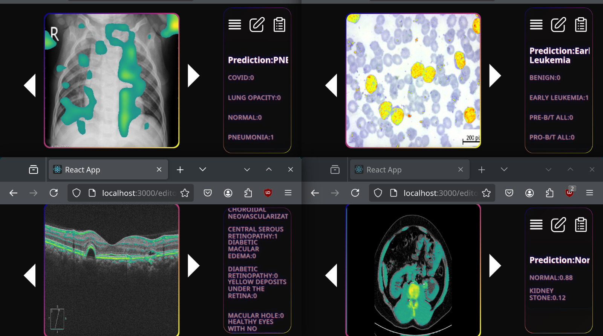
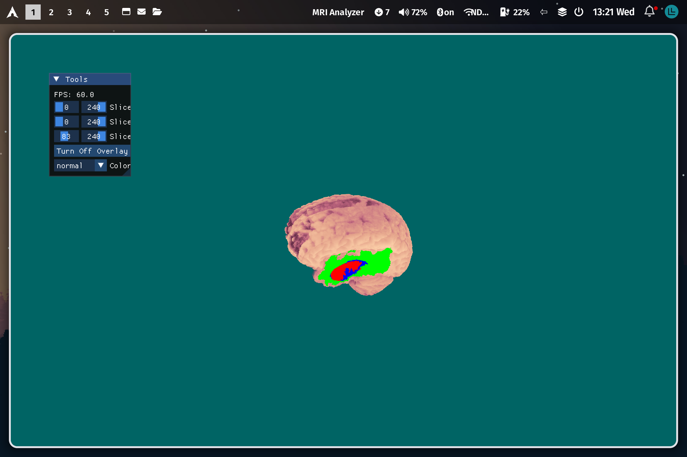

# AI assisted diagnosis and segmentation tools


A series of tools designed for analyzing medical images that can help clinicians by speeding up the diagnosing process and reducing the numbers of false negatives by marking the regions of interest, so the clinician wouldn't miss any important details.

## Brain reconstruction

This repository contains both a web-app and a desktop-app. The desktop-app can reconstruct the brain structure using .nii volumes.

|  |  |
|---|---|
|  |  |

## Diagnosis

The program can recognise the following conditions:

- Brain tumors (Glioma, Pituary, Mengioma)
- Lung disease (Covid, Pneumonia, etc)
- Eye disease based on OCT (Glaucoma, Diabetic Retinopathy etc)
- Kidney stones
- Lymphoid Leukemia
  
The program should not be fully trusted. I was designed to assist clinicians, not to replace them. The clinician can also check the AI's activations to visualize the areas of interests and see the information the model based it's assumption on to get a better understanding of the image.



## Segmentation

Besides the activations, the program can also provide segmentation masks for leukemia and brain tumors. The program is able to detect abnormalities in the medical images and mark the regions and assigned them a label.

|  |  |
|---|---|
|  |  |

- Red: Necrotic Core
- Blue: Active Tumor
- Green: Edema

## Installation

### Desktop-App

#### Important

Make sure you have my game engine installed. Since the volumes are rendered using my own graphic libraries. If not check the link bellow

[Game Engine](https://github.com/TRBogdann/Game-Engine)

### Linux

__Warning: The model might be incompatible with your current version of ternsorflow or keras. If that's the case (the model cannot be loaded) make sure to downgrade it__

```bash
git clone https://github.com/TRBogdann/Licenta
cd Licenta/desktop-app
chmod +x install.sh
./install.sh
```


### Web-App

Fist clone the repository

```bash
git clone https://github.com/TRBogdann/Licenta
cd Licenta/web-app
```

#### Client

```bash
cd client/app
npm install
```

Then you can run using

```bash
npm start
```

You should se something like this:


#### Server

__Warning: The models might be incompatible with your current version of ternsorflow or keras. If that's the case (the model cannot be loaded) make sure to downgrade it__

Create venv and install packages

```bash
cd server
python3 -m venv .venv
python3 -r install requirements.txt
```

Start

```bash
python3 main.py
```